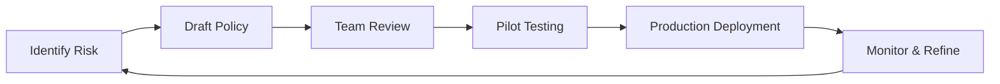

# Best Practices for AI Governance

Implementing effective AI governance requires combining technical controls with organizational practices. These best practices will help you maximize security benefits while maintaining developer productivity in AI-assisted workflows.

## 🎯 Core Principles

### **1. Security by Default**
Configure Codeward to catch security issues without manual intervention:

```json
{
  "global": {
    "dependency_tree": true  // Enable comprehensive analysis
  },
  "vulnerability": [{
    "name": "Default security baseline",
    "actions": {
      "new": "block",      // Prevent new critical issues
      "existing": "warn",  // Track existing issues for remediation
      "removed": "info"    // Celebrate improvements
    },
    "rules": {
      "severity": [{"type": "eq", "value": "CRITICAL"}]
    }
  }]
}
```

### **2. Progressive Enhancement**
Start with basic policies and gradually increase coverage:

```json
{
  "vulnerability": [
    {
      "name": "Phase 1: Critical only",
      "action": "block",
      "rules": {"severity": [{"type": "eq", "value": "CRITICAL"}]}
    },
    {
      "name": "Phase 2: High severity",
      "action": "warn",  // Will become "block" later
      "rules": {"severity": [{"type": "eq", "value": "HIGH"}]}
    }
  ]
}
```

### **3. Developer Experience First**
Ensure security measures enhance rather than hinder development:

- **Clear Error Messages**: Provide actionable feedback
- **Fast Feedback Loops**: Integrate with CI/CD for immediate results
- **Educational Content**: Include security guidance in scan results

## 🏗️ Organizational Best Practices

### **Team Structure & Responsibilities**

**Security Champions Program:**
- Designate security-aware developers in each team
- Provide advanced Codeward training
- Empower champions to refine policies

**Clear Ownership:**
```yaml
# RACI Matrix for AI Security Governance
Policy Creation: Security Team (R), Engineering Leads (A), Developers (C)
Policy Updates: Security Champions (R), Security Team (A), Teams (I)
Violation Response: Developers (R), Security Champions (A), Security Team (C)
Metrics Review: Engineering Leads (R), Security Team (A), Management (I)
```

### **Policy Lifecycle Management**

**1. Policy Development Process:**


**2. Change Management:**
```json
{
  "policy_metadata": {
    "version": "1.2.0",
    "last_updated": "2025-09-07",
    "review_date": "2025-12-07",
    "owner": "security-team",
    "change_log": [
      "Added medium severity blocking",
      "Refined license policies"
    ]
  }
}
```

### **Training & Education**

**Developer Onboarding:**
1. **AI Security Awareness**: Risks specific to AI-assisted development
2. **Codeward Training**: How to interpret and act on scan results
3. **Policy Familiarization**: Understanding team-specific security policies
4. **Remediation Workflows**: Standard procedures for fixing security issues

**Ongoing Education:**
- Monthly security newsletters with real examples
- Quarterly policy review meetings
- Annual security training updates
- Incident post-mortems with learning outcomes

## 🔧 Technical Best Practices

### **Configuration Management**

**Version Control for Policies:**
```bash
# Store configurations in version control
git add config.json
git commit -m "feat: add license compliance policies"
git push origin main
```

**Environment-Specific Configurations:**
```json
{
  "environments": {
    "development": {
      "vulnerability": [{"action": "warn"}]
    },
    "staging": {
      "vulnerability": [{"action": "block"}]
    },
    "production": {
      "vulnerability": [{"action": "block"}],
      "validation": [/* Additional prod-specific rules */]
    }
  }
}
```

### **Integration Patterns**

**GitHub Actions Best Practices:**
```yaml
name: Comprehensive Security Scan
on:
  pull_request:
    types: [opened, synchronize, reopened]
  push:
    branches: [main, develop]

jobs:
  security-scan:
    runs-on: ubuntu-latest
    timeout-minutes: 15  # Reasonable timeout
    permissions:
      contents: read
      pull-requests: write
      
    steps:
      - name: Checkout code
        uses: actions/checkout@v4
        with:
          fetch-depth: 0  # Full history for accurate diff analysis
          
      - name: Security Scan
        uses: codeward-io/scan@v0.0.1
        with:
          event: ${{ github.event_name }}
          repository: ${{ github.repository }}
          current_branch: ${{ github.ref }}
          pr_number: ${{ github.event.number }}
```

**Multi-Repository Management:**
```json
{
  "shared_policies": {
    "critical_vulnerabilities": {
      "action": "block",
      "rules": {"severity": [{"type": "eq", "value": "CRITICAL"}]}
    }
  },
  "repository_overrides": {
    "experimental-projects": {
      "vulnerability": [{"action": "warn"}]  // More lenient for experiments
    },
    "production-services": {
      "vulnerability": [
        {"action": "block", "severity": "CRITICAL"},
        {"action": "block", "severity": "HIGH"}  // Stricter for production
      ]
    }
  }
}
```

### **Performance Optimization**

**Scan Optimization:**
```json
{
  "global": {
    "dependency_tree": false,  // Disable for faster scans if not needed
    "ignore": {
      "paths": ["node_modules/", "vendor/", ".git/"],
      "files": ["*.test.js", "*.spec.ts"],
      "file_extensions": [".log", ".tmp"]
    }
  }
}
```

**Caching Strategy:**
```yaml
- name: Cache scan results
  uses: actions/cache@v3
  with:
    path: ~/.cache/codeward-scan
    key: scan-cache-${{ hashFiles('**/package-lock.json', '**/go.sum') }}
    restore-keys: scan-cache-
```

## 📊 Monitoring & Metrics

### **Key Performance Indicators**

**Security Metrics:**
- **Mean Time to Detection (MTTD)**: How quickly issues are identified
- **Mean Time to Resolution (MTTR)**: How quickly issues are fixed
- **Security Debt**: Accumulation of known security issues
- **Policy Effectiveness**: Percentage of policies triggering appropriately

**Developer Experience Metrics:**
- **Scan Duration**: Time taken for security scans
- **False Positive Rate**: Incorrect security alerts
- **Developer Satisfaction**: Survey scores on tool usability
- **Productivity Impact**: Effect on development velocity

**Business Metrics:**
- **Risk Reduction**: Measurable decrease in security exposure
- **Compliance Score**: Adherence to security standards
- **Cost Avoidance**: Value of prevented security incidents
- **Audit Readiness**: Time saved during security audits

### **Monitoring Implementation**

**Metrics Collection:**
```json
{
  "outputs": [{
    "format": "json",
    "destination": "file:metrics/security-metrics.json",
    "fields": ["Severity", "PkgName", "VulnerabilityID"],
    "title": "Security Metrics Export"
  }]
}
```

**Dashboard Integration:**
```bash
# Example: Send metrics to monitoring system
curl -X POST https://metrics.company.com/api/security \
  -H "Content-Type: application/json" \
  -d @metrics/security-metrics.json
```

## 🚨 Incident Response

### **Security Issue Escalation**

**Severity Classification:**
- **P0 (Critical)**: Active exploits, production impact
- **P1 (High)**: High-severity vulnerabilities in production
- **P2 (Medium)**: Medium-severity issues, non-production impact
- **P3 (Low)**: Informational findings, technical debt

**Response Procedures:**
```json
{
  "incident_response": {
    "P0": {
      "notification": ["security-team", "engineering-leads", "management"],
      "timeline": "immediate",
      "action": "emergency-patch"
    },
    "P1": {
      "notification": ["security-team", "engineering-leads"],
      "timeline": "24-hours",
      "action": "priority-patch"
    }
  }
}
```

### **Emergency Workflows**

**Hotfix Process:**
1. **Immediate Assessment**: Severity and impact evaluation
2. **Bypass Authorization**: Temporary policy override if needed
3. **Rapid Development**: Focused fix implementation
4. **Expedited Review**: Security-focused code review
5. **Emergency Deployment**: Fast-track to production
6. **Post-Incident Review**: Process improvement analysis

**Communication Templates:**
```markdown
## Security Incident Alert - P1

**Issue**: High-severity vulnerability in production dependency
**Impact**: Potential data exposure in user authentication
**Status**: Investigating
**ETA**: Fix deployed within 24 hours
**Contact**: security-team@company.com

**Immediate Actions**:
- [ ] Vulnerability assessment complete
- [ ] Fix development in progress
- [ ] Stakeholder notification sent
- [ ] Monitoring increased
```

## 🔄 Continuous Improvement

### **Regular Review Cycles**

**Weekly**: Team retrospectives on security findings
**Monthly**: Policy effectiveness review
**Quarterly**: Comprehensive security metrics analysis
**Annually**: Strategic security governance assessment

### **Feedback Integration**

**Developer Feedback Collection:**
```yaml
# Survey automation
survey_trigger: after_policy_violation
questions:
  - "Was the security alert actionable?"
  - "How can we improve the developer experience?"
  - "What additional training would be helpful?"
```

**Policy Refinement Process:**
1. Collect feedback from all stakeholders
2. Analyze false positive/negative rates
3. Review industry best practices and emerging threats
4. Test policy changes in staging environment
5. Gradually roll out improvements to production

### **Staying Current**

**Threat Intelligence Integration:**
- Subscribe to security advisories for used technologies
- Monitor AI security research and best practices
- Participate in security communities and conferences
- Regular review of Codeward updates and new features

**Technology Evolution Adaptation:**
- Monitor new AI development tools and their security implications
- Update policies for new programming languages and frameworks
- Integrate with emerging security tools and standards
- Adapt to changing regulatory requirements

## 📝 Documentation & Knowledge Management

### **Policy Documentation**

**Standard Format:**
```markdown
# Policy Name: Critical Vulnerability Blocking

## Purpose
Prevent critical security vulnerabilities from entering production.

## Scope
All repositories with production deployments.

## Implementation
```json
{policy configuration}
```

## Exceptions
- Emergency hotfixes (requires security team approval)
- Experimental projects (separate policy applies)

## Related Policies
- High Severity Warning Policy
- License Compliance Policy
```

### **Runbook Creation**

Maintain operational runbooks for:
- Common security issue remediation
- Policy override procedures
- Incident response workflows
- Tool troubleshooting guides

### **Knowledge Sharing**

- **Security Wiki**: Centralized security documentation
- **Best Practice Library**: Curated security patterns
- **Case Study Collection**: Real-world security incident learnings
- **Training Materials**: Onboarding and ongoing education resources

---

**Ready to implement these practices?** Start with:
- [Installation Guide](../installation/github-actions.md)
- [Configuration Overview](../configuration/overview.md)
- [Policy Examples](../examples/starter-configs.md)

## Related Topics

- [Security Risks in AI Development](./security-risks.md)
- [Policy Enforcement Strategies](./policy-enforcement.md)
- [GitHub Actions Setup](../installation/github-actions.md)
- [Configuration Management](../configuration/overview.md)
